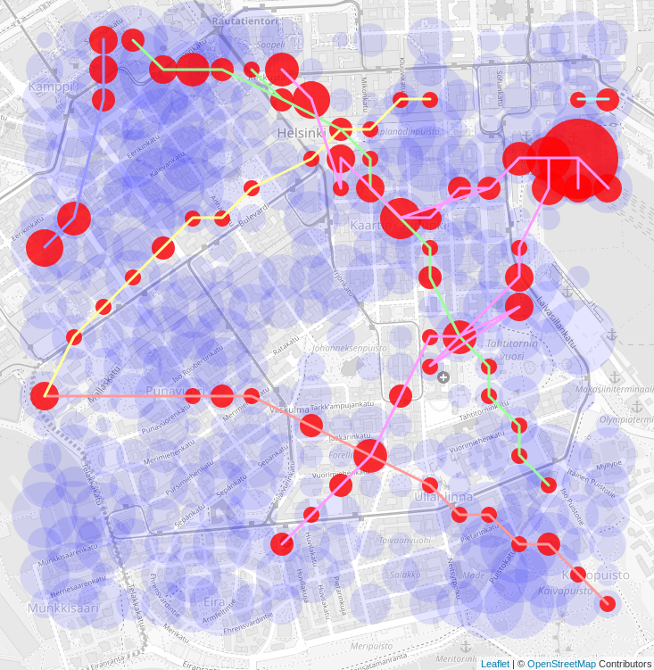

# BLE contact tracing sniffer PoC

How "anonymous" is the semi-decentralized BLE contact tracing proposed by [Apple & Google](https://www.apple.com/covid19/contacttracing)?

It is as anonymous as the simulated picture below - and this data is technically accessible to **any 3rd party who can install a large fleet of BLE-sniffing devices**. This is because all beacons signals broadcast by infected individuals are published to essentially all users of the system when an individual voluntarily uploads their positive infection status.

This repository contains a Proof-of-Concept implementation of a BLE-sniffing system that could uncover this data.

## Simulation

The image shows the results of a simulation where 400 BLE-sniffing devices would have been deployed in a 20×20 grid over an area of 1500×1500 m². The movement of 300 people around the area have been (crudely) simulated as random walks.

The red circles correspond beacon signals recorded from infected individuals, who have voluntarily uploaded their positive infection status to the local health authorities (5% of the paths in the simulation). Blue circles are signals recorded from other people using the contact tracing service. As illustrated by the lines connecting the red dots, the route traveled by each infected & announced individual can be reconstructed within the range of the sniffer grid.

See `backend/generate_fake_data.js` for details.

## System overview

A BLE-sniffing system consists of

 1. A significant number of BLE-sniffing devices installed to different known physical locations. An example implementation is given for Linux. Mobile phones could also act as BLE sniffers. They passively listen to contact tracing BLE traffic and upload it to the server(s).

 2. A device running an official local contact tracing app on a device which is hacked to intercept the confirmed positive _diagnosis keys_ the app downloads from the local health authorities' servers (see [Google's spec][O1] for the terminology). This part is not described in this repository, but it is an easy task and infeasible to prevent effectively.

 3. The server(s) receive the BLE contact tracing data, namely the _rolling proximity identifiers_ (RPIs) from the agents and the _diagnosis keys_ from the hacked app.

[O1]: https://www.blog.google/documents/68/Android_Exposure_Notification_API_documentation_v1.2.pdf

## Linux agent

A simple BLE sniffer implementation for Linux. Listens to BLE messages from the Apple/Google Contact Tracing (a.k.a. Exposure Notification) protocol.

#### Installation

Tested on Debian Stretch

 1. Make sure the `hcidump` and `hcitool` BLE tools are installed, e.g.,
   on Debian: `sudo apt-get install bluez-hcidump`
 2. Run as root `cd linux; sudo ./run.sh`. See `run.sh` for more info. Requires Python 2.7.

## Android app

A minimalistic app for sending various BLE beacon messages from an Android phone, including spoofed Contact Tracing payloads.

The app can be installed through Android Studio or running `cd android; ./gradlew installDebug` - assuming you have working Android development environment installed. Make sure you have Bluetooth on in the phone and see Android Logcat for details of what the app is supposed to broadcast.

No official implementations have been released at the time of writing, so it's difficult to confirm if the spoofed messages are compatible with the actual protocol or not (only [example UI code][A4] has been released). However, the only difference between the Exposure Notification [BLE specification][A1] and the Google Eddystone base protocol (cf. the diagram [here][A2]) seem to be the 16-bit service UUID (0xFAAA vs 0xFD6F) and the BLE advertise flags (0x06 vs 0x1A). Based on this observation and comparison to Google's Eddystone broadcast [example code][A3], the messages broadcast by this app are "close enough" to confirm that the _Linux agent_ will be able to observe the real Contact Tracing beacons as well, which is the main point of the Android test app.

[A1]: https://www.blog.google/documents/70/Exposure_Notification_-_Bluetooth_Specification_v1.2.2.pdf
[A2]: https://os.mbed.com/teams/Bluetooth-Low-Energy/code/BLE_EddystoneBeacon_Service/file/dfb7fb5a971b/Eddystone.h/
[A3]: https://github.com/google/eddystone/blob/txeddystone/tools/txeddystone/TxEddystone/app/src/main/java/com/google/sample/txeddystone/MainActivity.java
[A4]: https://github.com/google/exposure-notifications-android

## Backend server

A minimalistic server that can receive data from a fleet of sniffers, store it in a database, and visualize the results. HTTPS and authentication are currently not supported, but could be added using a reverse proxy. A single SQLite database cannot cope with a very high volume of data, but could be rather easily sharded.

#### Installation
exposure
 1. Setup NodeJS
 2. `cd backend`
 3. `npm install`
 4. `mkdir -p data`

By default, the data is stored to the SQLite file `backend/data/database.db`,
which can be directly examined/debugged with, e.g., the `sqlitebrowser` program.

#### Run simulation

 1. To populate the database with simulated data, run `node generate_fake_data.js`.
    This will erase any previous contents of the database.
 2. Run `node index.js`
 3. Go to http://localhost:3000 to observe the results.
    They will be shown on top of Open Street Map (using Leaflet)

#### Run on real devices

 0. Clear any previous data: delete `backend/data/database*`
 1. Start the server :`node index.js` (see the file for `BIND` and `PORT` options).
 2. Start the Linux agent(s): `cd linux; sudo ./run.sh`
    change `SERVER` in `run.sh` and the spec in `agent.json` as necessary.
 3. Run the Android test app to spoof Contact Tracing messages with a
    known _temporary exposure key_ (TEK)
 4. Open http://localhost:3000 (should show a blue circle)
 5. Mark the exposure key as infected, i.e., as a _diagnosis key_

        cd linux; resolve.py 6578616d706c65000000000000000000

 6. Refresh the browser, the circle should have turned red

**DISCLAIMER**: This repository is a Proof-of-Concept. Deploying this kind of a system _at scale_ would be a very bad idea for the following reasons:

 * It may be illegal. It very probably is under the GDPR/CCPA - unless you are a goverenmental entity who can argue it's for the greater good. Then different rules apply (also under the GDPR).
 * Even if it would be legal today, it could be illegal tomorrow. New legislation about the misuse of contact tracing data are being drafted in some countries.
 * This implementation is not tested or secure (no HTTPS or authentication and, e.g., the parsing Python scripts can crash on invalid payloads)
 * This implementation is AGPL-licensed (on purpose)

## More discussion

_See also my [blog post on Medium][D3] for a longer technical background story on BLE contact tracing and indoor positioning._

The data exposed by the BLE contact tracing systems is called _pseudonymous_: name, email, or other direct personal contact information is not known to the system, but the trails of locations themselves often single out an individual. For example, work and home locations are often easy to identify from the data.

BLE-sniffing devices have already been deployed (see, e.g., the [links here][D1]) for other purposes. In addition, any smart phone also has the technical ability to act as as one (for any third-party application), but Google & Apple can block this if this privacy issue is seen as more serious in the future. However, there are millions of devices controlled by other organizations which can potentially be transformed into BLE sniffers with an OTA software/firmware update. Laptops & cars for sure, new WiFi APs maybe, the rest of the Internet-of-Things - security cameras, fridges, cars, etc. - anyone's guess.

It is unclear to me how serious the various designers of the proposed contact tracing systems (i.e, the DP-3T group, Google, and Apple) think this weakness is. Is it a bug or a feature? If I had to select a click-bait headline, I would go for "side-channel attack vulnerability". Concerns about this have been raised before (e.g, [here][D1] and [here][D2]). As a general principle, the legal consequences of exploiting a weakness, or the requirement that the attacker needs some budget for hardware, are usually not considered good defenses in cybersecurity.

[D1]: https://github.com/DP-3T/documents/issues/43
[D2]: https://github.com/TCNCoalition/TCN/blob/ad400bc56d6b76e9fcec2901ae21206c0e2230ce/README.md#report-timespans-and-key-rotation
[D3]: https://medium.com/indooratlas/why-use-bluetooth-for-contact-tracing-1585feb024dc
